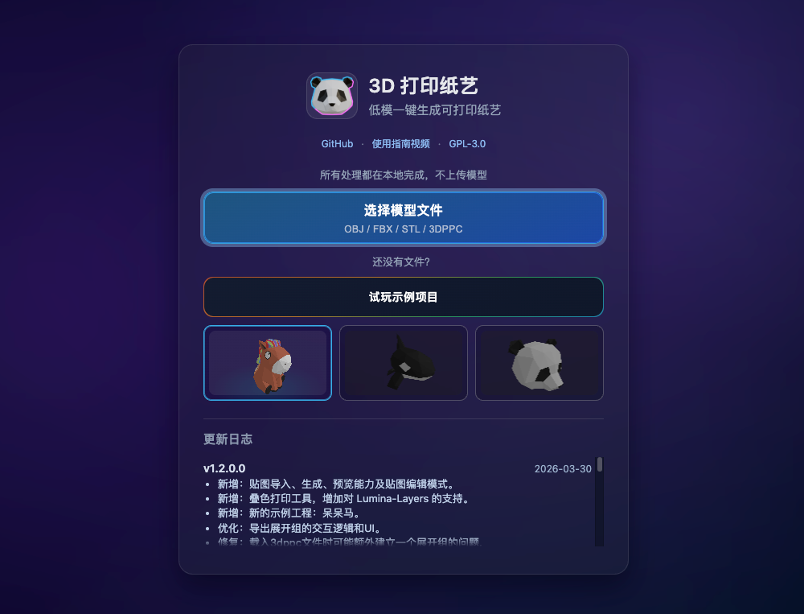
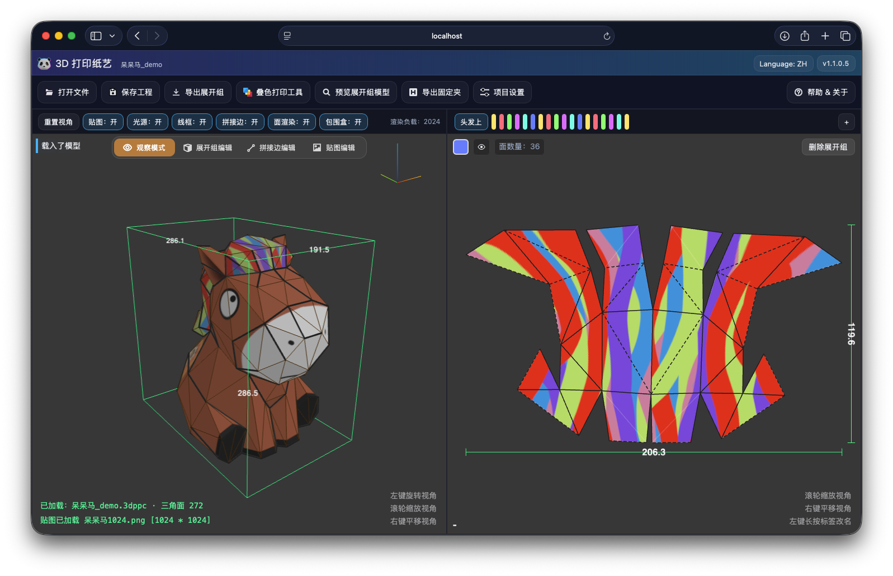

[简体中文](README.md) | [English](README.en.md)

# 3D 打印纸艺（3D Printed Paper Craft）

将低多边形（Low-poly）3D 模型转换为**可直接 3D 打印**的纸艺结构模型，并提供“组（Group）/ 展开编辑”工作流，帮助你把模型拆分、导出，完成打印与组装。

- 在线体验： https://3dppc.kilomelo.com
- 演示视频（B 站）：https://www.bilibili.com/video/BV1cAZkBeEZ6
- 当前版本：`v1.2.1.4`

---

## 截图

### 首页



### 编辑器



---

## 功能概览

- **导入模型**：支持 OBJ / FBX / STL / 3DPPC
- **3D 视图操作**：旋转 / 缩放 / 平移
- **编辑模式**
  - 观察模式
  - 展开组编辑
  - 拼接边编辑
  - 贴图编辑
- **组（Group）编辑**（核心概念）
  - 新建、删除、重命名组
  - 添加/移除三角面到组
  - 组旋转、颜色、显示/隐藏
  - 组展开预览
- **贴图能力**
  - 导入贴图、自动生成贴图、清除贴图
  - 贴图预览与导出
  - 可配置色彩空间/翻转/生成分辨率
- **导出**
  - 导出展开组模型为 **STEP** / **STL**
  - 导出展开组贴图为 **PNG**
  - 导出 **拼接边固定夹 STL**（用于连接/固定）
  - 导出项目为 **3DPPC**（此项目专用格式，可选是否包含贴图）
- **叠色打印工具**
  - 支持 Lumina-Layers 工作流（贴图导出 + 3MF 导入处理）
- **首页体验**
  - 示例工程快速试玩
  - 内置更新日志入口

---

## 快速上手

1. 打开在线站点： https://3dppc.kilomelo.com
2. 点击 **选择模型文件**，导入你的模型（OBJ/FBX/STL/3DPPC）
3. 进入 **展开组编辑**：
   - 新建组（Group）
   - 将三角面添加到组中（把模型拆成多个可处理的部分）
4. 按需切换编辑模式（拼接边/贴图），调整分组、拼接方式与贴图
5. 根据需要调整项目设置（如缩放、层高、连接层数、舌片参数、贴图参数等）
6. 预览组模型并导出文件（STEP / STL / PNG / 固定夹 STL / 3DPPC），进入 3D 打印流程

> 具体操作细节请参考演示视频： https://www.bilibili.com/video/BV1cAZkBeEZ6

---

## 项目设置（参数说明）

应用提供一组与打印/拼接/贴图相关的参数（例如：缩放比例、打印层高、连接层数、主体额外层数、舌片宽度/厚度、夹子配合间隙、贴图色彩空间、贴图翻转、贴图分辨率等）。  
建议初次使用时先保持默认值，跑通一次“导入 → 分组 → 预览/导出 → 打印”的流程，再根据打印效果微调。

---

## 更新日志

- 中文完整日志：[`public/changelog.md`](public/changelog.md)
- English changelog: [`public/changelog_en.md`](public/changelog_en.md)

最近版本（摘录）：
- `v1.2.0.0`（2026-03-29）：新增贴图导入/生成/预览和贴图编辑模式，新增叠色打印工具（Lumina-Layers），并新增呆呆马示例工程。
- `v1.1.0.0`（2026-03-12）：新增咬合（无卡扣）拼接方案、虎鲸示例工程。

---

## 技术栈与依赖

本项目是一个纯前端 Web 应用：

- 构建：Vite
- 语言：TypeScript
- 3D 渲染：Three.js
- CAD/几何建模：Replicad + OpenCascade（WASM）

依赖版本：

- `replicad` `^0.20.5`
- `replicad-opencascadejs` `^0.20.2`
- `three` `^0.160.0`
- `typescript` `^5.3.3`
- `vite` `^5.0.8`

---

## 本地开发

如果你只是使用工具，可以直接使用在线站点；如果你想本地运行/二次开发：

### 环境要求

- Node.js（建议 >= 18）

### 安装与启动

```bash
npm install
npm run dev
```

## 许可（License）

本项目采用 **GPL-3.0** 许可证发布，详见 [LICENSE](LICENSE)。  
分发修改版或衍生作品（包括商业分发）请遵守 GPL-3.0 条款：保留版权声明、提供源码并以 GPL-3.0 继续开源。

## 相关项目

- [Lumina-Layers](https://github.com/MOVIBALE/Lumina-Layers/) - 基于物理校准的多材料FDM色彩系统

---

## 赞助 / 打赏

如果你觉得这个项目对你有帮助，欢迎赞助任意金额，支持网站运营与持续开发，谢谢！

| 微信 | 支付宝 |
| --- | --- |
|  |  |
